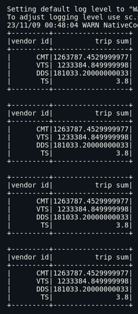

# Teste Técnico OpenCo
Este repositório contém as resoluções para o teste técnico Python da OpenCo
Para rodar o projeto com todas as dependências utilizadas, basta criar um ambiente virtual e instalar as deps que estão no arquivo `requirements.txt`
As respostas para cada questão estão aqui mesmo no README.

Neste projeto foram utilizados:
Python
Pandas
PySpark
Numpy
Pytest

## ATENÇÃO:
Devido a problemas com o LFS do Github, tive que excluir os arquivos json relacionados a etapa 2 do teste, portanto, caso queiram rodar as funções, será preciso adicioná-los manualmente à pasta `step_two`.

# Comandos
Para disparar os métodos e ver os logs com as resoluções, entre na pasta desejada (`step_one` ou `step_two`) e rode:
```shell
make run
```

Para rodar os testes da pasta `step_one` rode:
```shell
make test
```

# Etapa 01

Desafio: A partir de uma base fictícia de empréstimos contendo informações cadastrais demográficas no aruivo `openco_etapa1_dataset.csv`,você deve:
1- Construir as análises abaixo, preferencialmente em Python e
2- Montar uma apresentação para explicar seus achados e seu raciocínio em geral

## Pergunta 1:
Traga o ticket, taxa e prazo médios desta amostra fictícia.

Todos os métodos utilizados na resolução dessa etapa estão no arquivo main.py dentro da pasta `step_one` devidamente comentados.

Conceito de ticket, taxa e prazo médios:
O ticket médio é o valor médio dos contratos, ou seja, o somatório do valor dos contratos
dividido pelo total de contratos. O mesmo vale para taxa e prazo, com 1 exceção: taxa e prazo
médios devem ser ponderados pelo valor contrato!

R:  Ticket médio: 24169.087385454546 - Resolução no método `get_average_contract_ticket`
    Taxa média: 4.428 - Resolução no método `get_term_weighted_average`
    Prazo médio: 11.82 - Resolução no método `get_rate_weighted_average`

## Pergunta 2:
Queremos saber. Quais as características típicas de um bom pagador? E as de um mal pagador?

Conceito de Bad:
Definimos determinado empréstimo como Bad quando este ultrapassa 180 dias de atraso.
Dessa forma, Bad = 1 define um mal pagador; Bad = 0 define um bom pagador.

Conceito de Loss:
Apesar de todos os clientes mal pagadores receberem a mesma marcação (Bad = 1), o impacto
financeiro varia bastante, pois um empréstimo que para de ser pago na 3ª parcela gera um
impacto financeiro muito maior do que um que deixa de ser pago na 8ª parcela, por exemplo.
Logo, o conceito de Loss que usamos é: [valor em aberto dos mal pagadores] / [valor principal +
juros total]


## Pergunta 2.1:
Quando olhamos do ponto de vista de Loss, será que as características dos bons e mal
pagadores que vimos olhando a bad continuam valendo?

R: Para determinar a diferença entre o bad e o bad do ponto de vista do loss, arredondei os resultados da fórmula de loss - que resultaram e 0 e 1 e observei que:
Considerando o conceito de Bad, nesta amostra teríamos:
Bad: 501 clientes
Not Bad : 1424 clientes

Dos clientes considerados mals pagadores, aplicando a fórmula de loss e considerando a categorização binária 0 e 1 ainda para atribuir bad e not bad, temos:
Bad - loss: 340
Not Bad - loss: 161
Sendo assim, mesmo estando no grupo de mals pagadores, 161 clientes representam risco aceitável para a liberação de crédito, aceitando essa ponderação, o número inicial de clientes mudaria:
Bad: de 501 para 340
Not Bad: de 1424 para 1585

Resoluções nos métodos: `get_bad_values` e `get_bad_values_by_loss`


## Pergunta 2.2:
Crie na base um score próprio, ou seja, uma categorização dos clientes que seja baseada nas
características que você viu que melhor separa bons e mal pagadores. Em seguida, verifique se
a bad e loss estão de acordo com o que você esperava.

R: Para criar um score próprio usei como base as métricas `divida_total_pj`, `atraso_corrente`, `bad`, `loss`. Tomando como exemplo os pesos que a Serasa usa para seu cálculo, temos:
Atraso: 55%
Dívidas: 33%
Loss: 12%

Este cálculo inicial não apresentou bons resultados principalmente considerando o `loss` que representa o risco de inadimplência que estamos usando como base. Dependendo de quanto o cliente já tenha pago antes de se tornar inadimplente, considerando valor do contrato com juros, ainda pode ser vantajoso conceder crédito a ele.
Alterei então os pesos para:

Atraso = 0.55
Dívidas = 0.12
Loss = 3.3

Este é o valor que o método apresenta, mas pelos resultados, ele também não foi eficiente. Apresenta discrepâncias muito grandes quando olhamos para os dados de bad, loss e o score previamente exibido na base.


# Etapa 02

Desafio: Construir um ETL utilizando o arquico `openco-test-datasets.zip`
Requisitos:
- Responder em PySpark
- Código limpo e simples de entender
- Deixar comentários no código
Obs: Critério de desempate: quem percorreu o maior percurso, ordem alfabética dos nomes

Todos os métodos utilizados na resolução dessa etapa estão no arquivo main.py dentro da pasta `step_two`

# Questões

## Pergunta 3.a:
Qual vendor mais viajou de táxi em cada ano?
R: Creative Mobile Technologies, LLC 
Resolução no método `get_vendor_with_highest_numbers_of_trip_per_year`

Obs: a quantidade de viagens e a soma das distâncias são iguais em todos os anos
Método que calcula quantidade de viagens por vendor: `get_total_distance_by_vendor`



## Pergunta 3.b:
Qual a semana de cada ano que mais teve viagens de táxi.
R:  2009: semana 11 / quantidade de viagens: 20921
    2010: semana 43 / quantidade de viagens: 20728
    2011: semana 16 / quantidade de viagens: 22143
    2012: semana 29 / quantidade de viagens: 23614

Resolução no método `get_week_with_the_most_trips_per_year`

## Pergunta 3.c:
Quantas viagens o vendor com mais viagens naquele ano fez na semana com mais
viagens de táxi no ano.
R: O vendor com maior viagens em todos os anos foi o Creative Mobile Technologies, LLC - id CMT
semana 11 / quantidade de viagens: 10097                                                               
semana 43 / quantidade de viagens: 9969                                                                
semana 16 / quantidade de viagens: 10636                                                               
semana 29 / quantidade de viagens: 11382 

Resolução no método `get_week_with_the_most_trips_per_year`